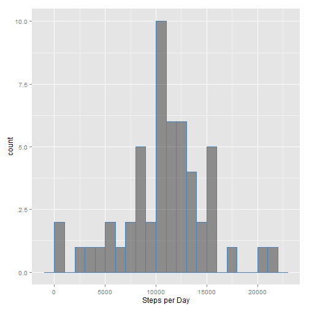
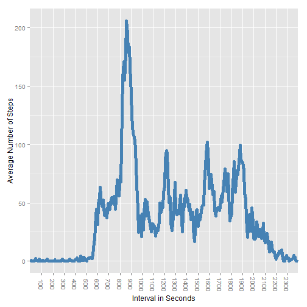
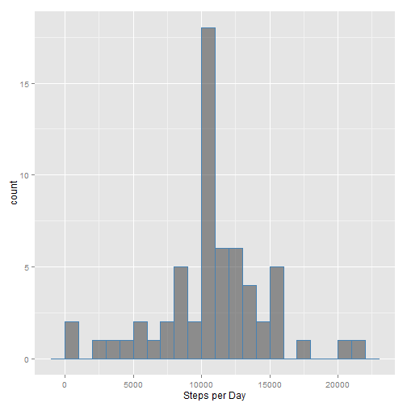
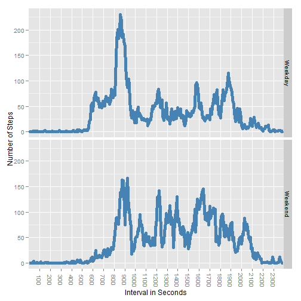

Reproducible Research - Assignment 1
========================================================

## Loading and Processing the Data
The data can be loaded and processed by implementing the following code:


```r
steps <- read.table("activity.csv", sep =",", header=T)
steps$interval <- factor(steps$interval)
steps$date <- as.Date(steps$date, "%Y-%m-%d")
```

## What is the mean number of steps taken per day?

We can see the distribution of the total number of steps taken each day using the following code:

Create a data frame that sums the steps up by date:

```r
stepsPerDay <-aggregate(steps$steps, by = list(steps$date), FUN= sum)
names(stepsPerDay) <- c("date", "steps")
stepsPerDay <- stepsPerDay[complete.cases(stepsPerDay),]
```

Draw a histogram based on the above data frame:

```r
library(ggplot2)
ggplot(stepsPerDay, aes(x=steps))+ 
        geom_histogram(binwidth=1000, color="steelblue", alpha=.5)+
        xlab("Steps per Day")
```

 

The daily mean is:

```r
mean(stepsPerDay$steps)
```

```
## [1] 10766
```

The daily median is:

```r
median(stepsPerDay$steps)
```

```
## [1] 10765
```


## What is the average daily activity pattern?

Let's first create a data frame that shows the mean of the time interval across all days.


```r
stepsRmNa <- steps[complete.cases(steps),]
meanStepsPerInterval <- aggregate(stepsRmNa$steps, by = list(stepsRmNa$interval), FUN= mean)
names(meanStepsPerInterval) <- c("interval", "meanSteps")
```

Now let's create a time series plot that shows the mean for each 5-minute interval across all days.


```r
ggplot(meanStepsPerInterval, aes(x=interval, y=meanSteps, group=1))+
        geom_line(size=2, color="steelblue")+
        scale_x_discrete(breaks=seq(100,2400,100))+
        theme(axis.text.x = element_text(angle =-90, vjust=.5))+
        ylab("Average Number of Steps")+ xlab("Interval in Seconds")
```

 

The max 5-minute daily average interval can be found using this code:

```r
library(plyr)
```

```
## Warning: package 'plyr' was built under R version 3.0.3
```

```r
head(arrange(meanStepsPerInterval, desc(meanSteps)),1)
```

```
##   interval meanSteps
## 1      835     206.2
```

## Inputting Missing Values

Up to this point I have been excluding rows that contained missing data. But as we can see here there are quite a few missing values.  

```r
sum(is.na(steps))
```

```
## [1] 2304
```

But let's use the 5-minute average for each time interval across all days and input that in each missing interval.

```r
impNaSteps <- steps

for(i in 1:length(steps$steps)) {
        if(is.na(impNaSteps$steps[i])){
                impNaSteps$steps[i] <- meanStepsPerInterval$meanSteps[which(impNaSteps$interval[i] == meanStepsPerInterval$interval)]
                
        }
}
```

Now let's create a similar histogram to the one we made while excluding missing data:

```r
stepsPerDay2 <-aggregate(impNaSteps$steps, by = list(impNaSteps$date), FUN= sum)
names(stepsPerDay2) <- c("date", "steps")

ggplot(stepsPerDay2, aes(x=steps))+ 
        geom_histogram(binwidth=1000, color="steelblue", alpha=.5)+
        xlab("Steps per Day")
```

 

The mean stays the same since the new values are the mean of each 5-minute interval.

```r
mean(stepsPerDay2$steps)
```

```
## [1] 10766
```

The median increases to equal the mean:

```r
median(stepsPerDay2$steps)
```

```
## [1] 10766
```

This is because the missing values were all 288 time intervals for 8 complete days (maybe the fitness band was turned off certain days). So by inputting the 5-minute interval average for each missing value we effectively created 8 daily observations at the mean.  You can notice this by looking at the difference between the two histograms.  The only bin that changes is the middle one.


## Are there differences in activity patterns between weekdays and weekends?

We'll need to create a column in our data frame that labels each interval observation as a weekday or weekend.

```r
impNaSteps <- transform(impNaSteps, weekday = weekdays(date))

defday <- function(x){
        if(x %in% c("Monday", "Tuesday", "Wednesday", "Thursday", "Friday")){
                "Weekday"
        }
        else{"Weekend"}
}

impNaSteps$weekday.weekend <- factor(sapply(impNaSteps$weekday,defday))
```

Now let's create a data frame that aggregates the rows by weekday/weekend and interval.


```r
meanStepsPerInterval2 <- aggregate(impNaSteps$steps, by = list(impNaSteps$interval,impNaSteps$weekday.weekend), FUN= mean)

names(meanStepsPerInterval2) <- c("interval","weekday","meanSteps")
```

Here is a plot breaking out the per interval averages by day classification:

```r
ggplot(meanStepsPerInterval2, aes(x=interval, y=meanSteps, group=weekday))+
        geom_line(size=2, color="steelblue")+
        facet_grid(weekday~.)   +    
        scale_x_discrete(breaks=seq(100,2400,100))+
        theme(axis.text.x = element_text(angle =-90, vjust=.5))+
        ylab("Number of Steps")+ xlab("Interval in Seconds")
```

 

It looks like during the weekday there is a spike in activity around 9 am (walk to work perhaps?) followed by lower activity levels when compared to the weekend.

